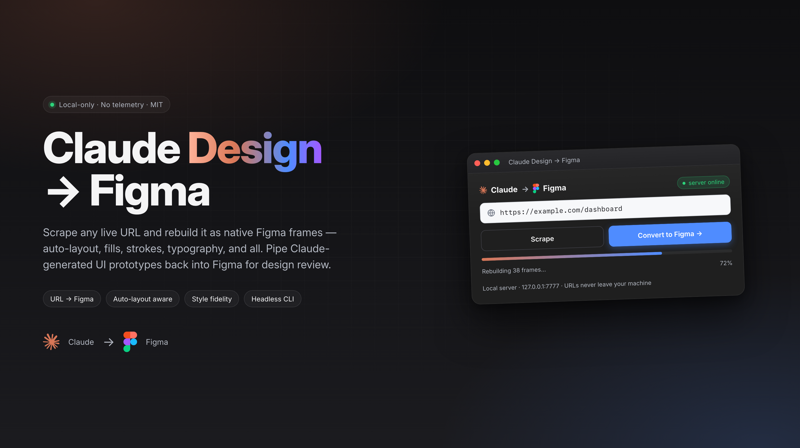
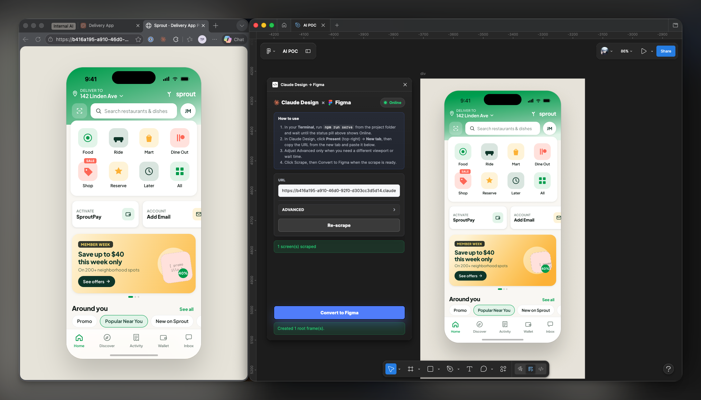
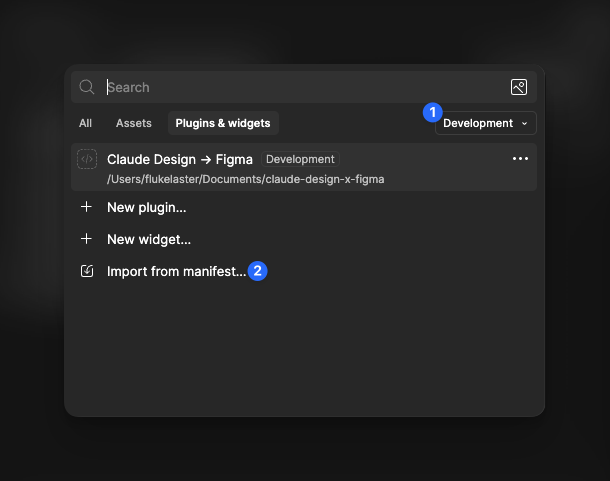
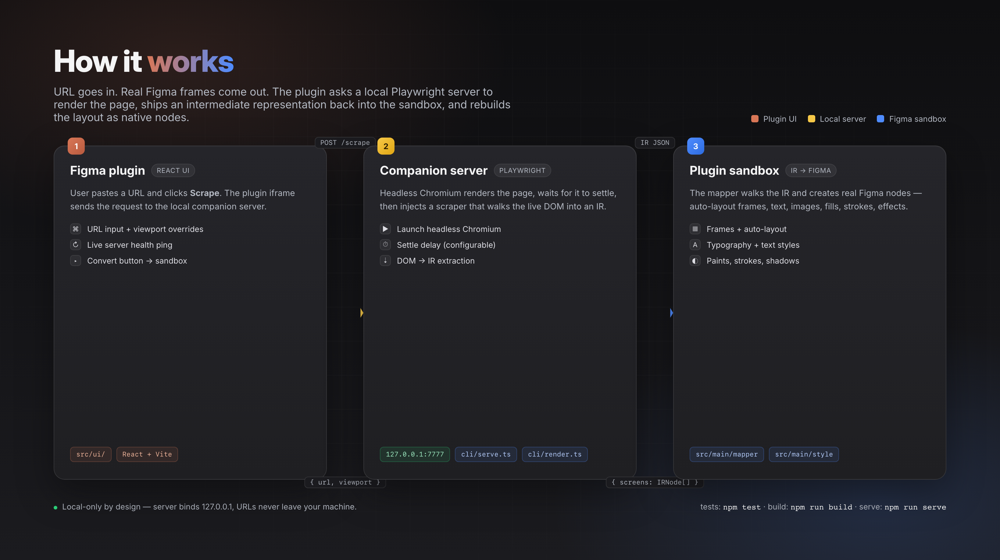
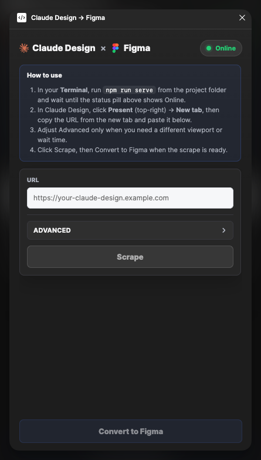

<h1 align="center">Claude Design → Figma</h1>

<p align="center">
  <em>Scrape any live URL and rebuild it as native Figma frames.</em><br/>
  Pipe Claude-generated UI prototypes back into Figma for design review — auto-layout, fills, strokes, typography, and all.
</p>

<p align="center">
  
</p>

<p align="center">
  <a href="#-quick-start">Quick start</a> ·
  <a href="#-how-it-works">How it works</a> ·
  <a href="#-usage">Usage</a> ·
  <a href="#-headless--ci">CLI</a> ·
  <a href="#-server-api">API</a> ·
  <a href="#-tech">Tech</a>
</p>

---

## ✨ Highlights

- **URL → Figma in one click.** Paste a URL, scrape, convert. The result is real Figma nodes — not a flat screenshot.
- **Auto-layout aware.** CSS flex/grid → Figma auto-layout, with proper spacing, padding, and alignment.
- **Style fidelity.** Fills, strokes, gradients, shadows, radii, and typography mapped through a dedicated style resolver.
- **Local-only.** Companion server binds `127.0.0.1`; URLs never leave your machine.
- **Headless CLI.** Same scrape pipeline, no browser required — useful for diffs, archival, or feeding other tools.

<p align="center">
  
</p>

---

## 🚀 Quick start

```bash
# 1. Install
npm install
npx playwright install chromium

# 2. Build the plugin
npm run build

# 3. Start the local scraper
npm run serve
# → http://127.0.0.1:7777
```

Then in **Figma desktop**:

> **Plugins → Development → Import plugin from manifest…** → pick `manifest.json`

<p align="center">
  
</p>

---

## 🧠 How it works

```
┌─────────────────┐     URL      ┌──────────────────────┐    IR JSON    ┌────────────────────┐
│  Figma plugin   │ ───────────▶ │  Companion server    │ ────────────▶ │  Plugin sandbox    │
│  (React UI)     │              │  Playwright + scrape │               │  IR → Figma nodes  │
└─────────────────┘              └──────────────────────┘               └────────────────────┘
```

1. **Companion server** (`npm run serve`) runs Playwright, renders the URL, and scrapes the live DOM into an intermediate representation (IR).
2. **Figma plugin** sends the URL to the server, receives the IR, and rebuilds the layout as real Figma nodes — frames, text, images, auto-layout, fills, strokes, effects.

<p align="center">
  
</p>

---

## 📁 Project layout

```
cli/                    Playwright-based scraper + CLI entry
  bin.ts                `claude-figma` binary
  render.ts             Headless render orchestration
  scrape-injected.ts    In-page DOM → IR extractor
  serve.ts              Local HTTP server for the plugin
src/
  main/                 Figma plugin sandbox code
    parser/             HTML → IR (when pasted directly)
    mapper/             IR → Figma nodes
    style/              CSS → Figma paint/effect/typography
    ir/                 IR types
  ui/                   Plugin UI (React + Vite)
  shared/               Messages shared between sandbox and UI
tests/                  Vitest unit tests
manifest.json           Figma plugin manifest
```

---

## 🛠 Build

```bash
npm run build       # build plugin sandbox + UI bundles into dist/
npm run watch       # rebuild sandbox on change
```

---

## 🎯 Usage

1. Start the companion server (once per session):
   ```bash
   npm run serve
   # → claude-figma serve → http://127.0.0.1:7777
   ```
2. In the plugin: paste the URL → click **Scrape** → wait → click **Convert to Figma**.

<p align="center">
  
</p>

### Advanced options

Collapsed in the UI by default:

| Field    | Purpose                                  |
|----------|------------------------------------------|
| `Width`  | Override viewport width                  |
| `Height` | Override viewport height                 |
| `Wait`   | Settle delay (ms) before scraping        |
| `Server` | Point plugin at a different host/port    |

Override host/port at start:

```bash
PORT=8080 HOST=0.0.0.0 npm run serve
# or
npm run serve -- --port 8080 --host 0.0.0.0
```

---

## 🤖 Headless / CI

Same scrape pipeline, no browser UI:

```bash
npm run cli -- <url> [-o screens.json] [--width 1440] [--height 900] [--wait 500]
```

Output is the IR JSON — useful for diffing, archival, or feeding other tools.

---

## 🌐 Server API

`cli/serve.ts` exposes:

| Method | Path      | Body                                            | Returns                            |
|--------|-----------|-------------------------------------------------|------------------------------------|
| GET    | `/ping`   | —                                               | `{ ok: true, service, version }`   |
| POST   | `/scrape` | `{ url, viewport?: {width,height}, waitMs? }`   | `{ screens: IRNode[], viewport }`  |

CORS is open (`*`) so the Figma plugin iframe can call it.

---

## 🧪 Tests

```bash
npm test
```

---

## 📝 Commit conventions

[Conventional Commits](https://www.conventionalcommits.org/). One concern per commit — split unrelated changes.

Format: `<type>(<scope>): <subject>`

| Type       | When to use                                                              |
|------------|--------------------------------------------------------------------------|
| `feat`     | New user-facing feature (new mapper rule, new CLI flag, new UI control)  |
| `fix`      | Bug fix (incorrect output, crash, regression)                            |
| `refactor` | Code restructure with no behavior change                                 |
| `perf`     | Performance improvement                                                  |
| `test`     | Add or update tests only                                                 |
| `docs`     | README / comments / type docs only                                       |
| `style`    | Formatting, whitespace, lint fixes (no logic change)                     |
| `chore`    | Tooling, deps, build config, gitignore, CI                               |
| `build`    | Vite / tsconfig / bundler changes                                        |
| `revert`   | Reverts a previous commit                                                |

Scopes (optional but preferred): `cli`, `plugin`, `mapper`, `parser`, `style`, `ui`, `ir`, `tests`.

<details>
<summary>Examples</summary>

```
feat(mapper): support CSS grid → auto-layout
fix(parser): handle self-closing  without alt
refactor(style): extract color resolver into module
chore: bump playwright to 1.60
docs: document --wait flag in README
test(mapper): cover nested flex containers
perf(cli): cache computed styles per element
```

</details>

Subject rules:
- imperative mood (`add` not `added`/`adds`)
- ≤ 72 chars
- no trailing period
- lowercase after type

Body (optional, blank line after subject): explain *why*, not *what*. Diff shows what.

Breaking change: append `!` after type/scope and add `BREAKING CHANGE:` in body.

```
feat(plugin)!: drop support for legacy IR v0 payloads

BREAKING CHANGE: scrape JSON from CLI < 0.1.0 will no longer load.
```

---

## 🧰 Tech

- **Playwright** — headless render
- **Vite + React** — plugin UI
- **TypeScript** — everywhere
- **Vitest** — unit tests
- **`@babel/parser`**, **`node-html-parser`**, **`colord`** — parsing & styling

---

<p align="center">
  <sub>Built for piping Claude-generated UIs back into Figma. Local-only. No telemetry.</sub>
</p>
